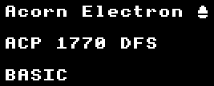
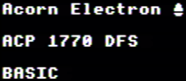
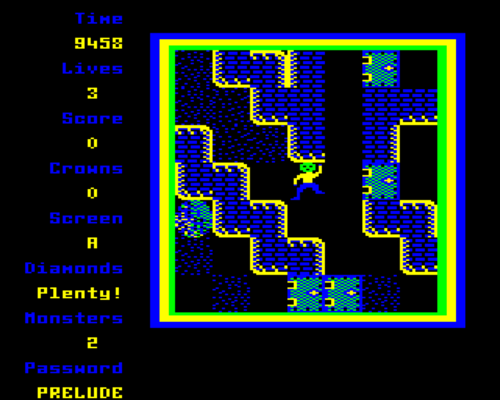
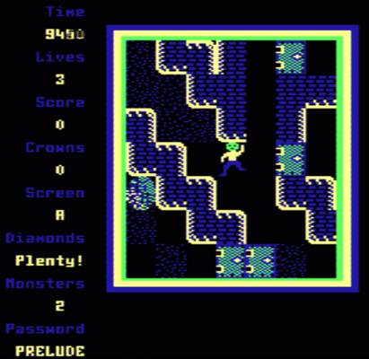
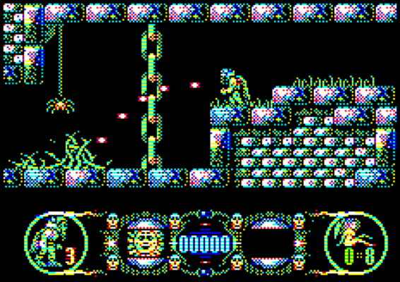
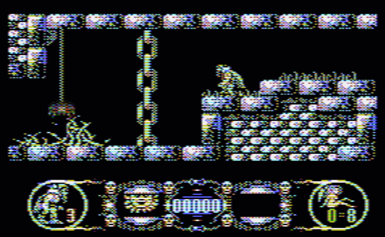
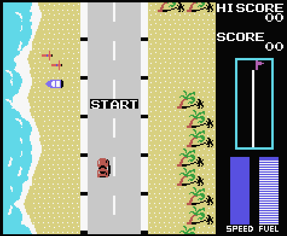
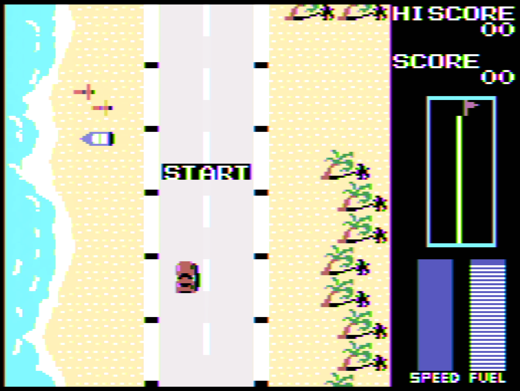
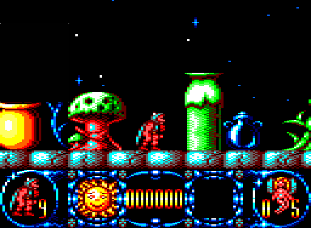

# Clock Signal
Clock Signal ('CLK') is an emulator for tourists that seeks to be invisible. Users directly launch classic software with no emulator or per-emulated-machine learning curve.

On the Mac it is a native Cocoa application. Under Linux, BSD and other UNIXes and UNIX-alikes it relies upon SDL 2.

So its aims are:
* single-click load of any piece of source media for any supported platform;
* with a heavy signal processing tilt for accurate reproduction of original outputs;
* that aims for the lowest possible latency; and
* 100% accurate emulations, naturally.

It currently contains emulations of the:
* Acorn Electron;
* Amstrad CPC;
* Atari 2600;
* ColecoVision;
* Commodore Vic-20 (and Commodore 1540/1);
* MSX 1;
* Oric 1/Atmos; and
* Sinclair ZX80/81.

## Single-click Loading

Through the combination of static analysis and runtime analysis, CLK seeks to be able automatically to select and configure the appropriate machine to run any provided disk, tape or ROM; to issue any commands necessary to run the software contained on the disk, tape or ROM; and to provide accelerated loading where feasible.

The full process of loading a title — even if you've never used the emulated machine before — is therefore:

1. locate it in your OS;
2. double click it.

## Signal Processing

Consider an ordinary, unmodified Commodore Vic-20. Its only video output is composite. Therefore the emulated machine's only video output is composite. In order to display the video output, your GPU then decodes composite video. Therefore all composite video artefacts are present and exactly correct, not because of a post hoc filter combining all the subjective effects that this author associates with composite video but because the real signal is really being processed.

Similar effort is put into audio generation. If the real machine normally generates audio at 192Khz then the emulator generates a 192Khz source signal and filters it down to whatever the host machine can output.

If your machine has a 4k monitor and a 96Khz audio output? Then you'll get a 4k rendering of a composite display and, assuming the emulated machine produces source audio at or above 96Khz, 96,000 individual distinct audio samples a second. Interlaced video also works and looks much as it always did on those machines that produce it.

### Samples

| 1:1 Pixel Copying | Composite Decoded |
|---|---|
|||
|||
|||
|||
|||

| 1:1 Pixel Copying | Correct Aspect Ratio, Filtered |
|---|---|
|||
|||

## Low Latency

The display produced is an emulated CRT, with phosphor decay. Therefore if you have a 140Hz monitor it can produce 140 distinct frames per second. Latency is dictated by the output hardware, not the emulated machine.

The machine update mechanism is influenced separately by both screen refresh and audio stream processing; audio latency is therefore generally restrained to 5–10ms regardless of your screen's refresh rate.

A corollary of emulating the continuous nature CRT, not merely performing end-of-frame transcriptions, is that the most common motion aliasing effects of displaying 50Hz video on a 60Hz display are minimised; you don't have to own niche equipment to benefit.

## Accurate Emulation

Cycle-accurate emulation for the supported target machines is fairly trite; this emulator seeks to follow that precedent. All emulation logic is written in C++ for explicit control over costs but, where a conflict arises, the presumption is towards clarity and simplicity of code. This emulator is willing to spend the processing resources available on modern hardware.

Self-ratings:
* the Electron, Oric and Vic-20 are pretty much perfect;
* the ZX80, ZX81, ColecoVision and MSX 1 are very strong;
* the Amstrad CPC has known accuracy deficiencies in its 8272 and 6845;
* the Atari 2600 has some known accuracy deficiencies in its TIA;
* the C-1540(/1) is locked in reading mode and doesn't yet support writing.
